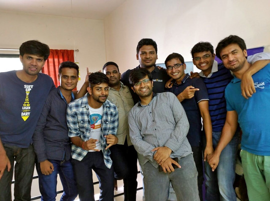
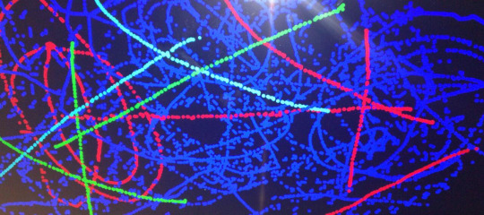
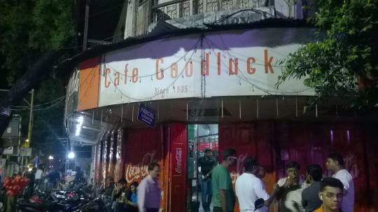
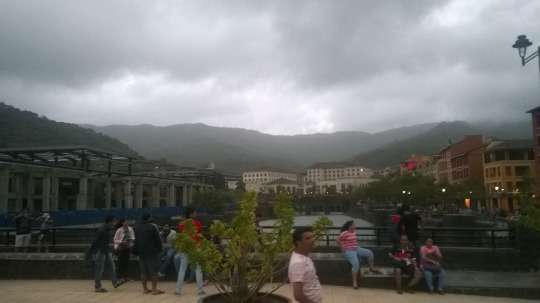
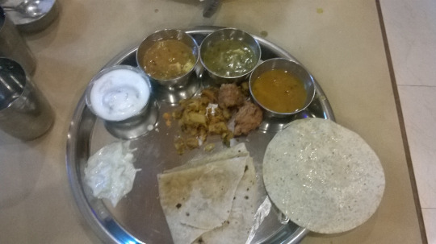

Hello there.

It has been time, since i have made an attempt to update my blog with the ongoing’s of my life. But now would be the right time probably.

Alot have changed in some months, like i am now a 4th Year Final student at Jaypee University of Engineering and Technology(JUET), Guna. That’s pretty bad-ass bro.

And as every engineer need to complete a mandatory training/internship at the end of the 3rd Year of B.Tech i also did.

In 2015, i attended [GopherConIndia](http://www.gophercon.in/) conference, Bangalore where i met alot of techies & awesome people. Where there was this one startup, that at that time were working on a exciting new technology which involved both hardware and software mashup on their new product called ‘Twist’, and immediately it was clear to me that i wanted to experience this work.

So i got an internship for 6 weeks at [RainingClouds](http://rainingclouds.com/)/[BetaCraft](http://betacraft.co/)
Pune from June to July of 2015.

This picture here people, depicts the whole team of RainingClouds.

Great people, Great work. Period.

My Work
-------

[Ressy](http://ressyapp.com/)

Ressy is real-time table management solution for restaurant industry. It’s a platform for publishing and availing discounts from various restaurants in real-time.

I worked on the back-end for the Ressy app, implemented various features for the app back-end on Golang, MongoDB, PostgreSQL etc.

[Twist](http://www.gettwist.tv/) is a powerful Android™ powered HDMI dongle which plugs into your TV. It’s a one stop solution for your family’s Gaming and Media entertainment needs.

I developed various touch drivers like *Multi-Touch driver and mouse pointer driver for the device during my internship.

This here, is the screen shot of our first successful Multi touch driver test painting with 3 points on the screen. That was a memorable day.

Pune
----

Well, I just loved pune. It was so refreshing, people are so nice, young people all around. I would argue that pune is probably the best city to live in india right now, if you are 20+, love life and need work.

With so much to offer pune stands out from other biggies of India like New Delhi, Bangalore, Mumbai etc. and the food is so versatile that even a month in pune you would be eating new stuff each day & the tastes are muah.

Some pictures.

)

Loved Pune Food :)

Conclusion
----------

Overall i had such a nice time and experience of a lifetime at my internship. With so much to learn both on the engineering side and lifestyle. BetaCraft is full of awesome people with so much to learn from, i was lucky to get such an opportunity to work with such great team on a great mission.

Here is my [Training Presentation](https://drive.google.com/file/d/0B19RfWY3tagHX3hTcmw3VmZSQTQ/view?usp=sharing).

Tadaa.
