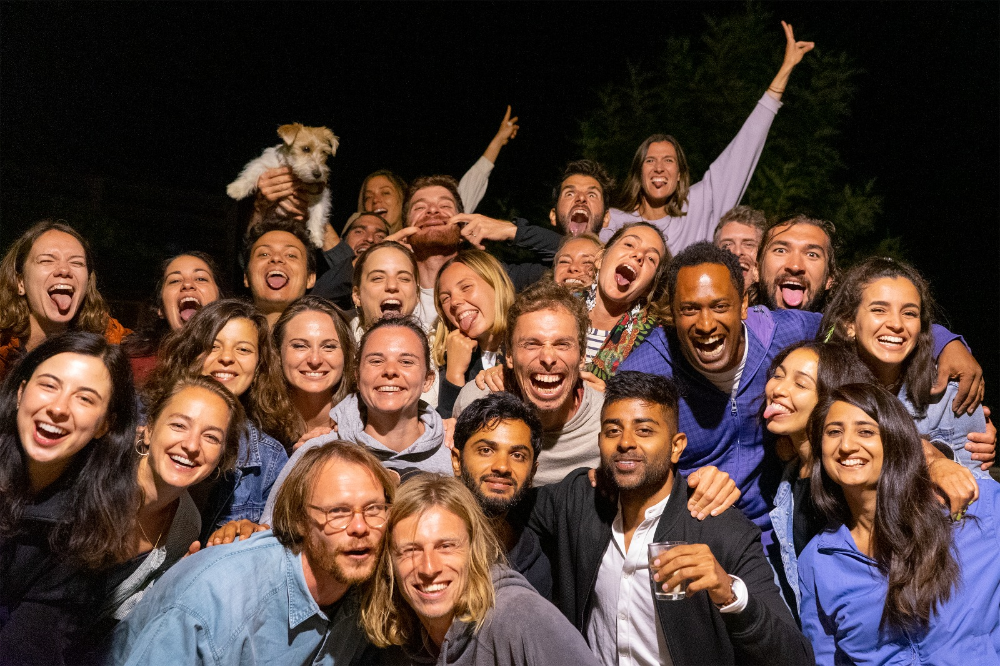
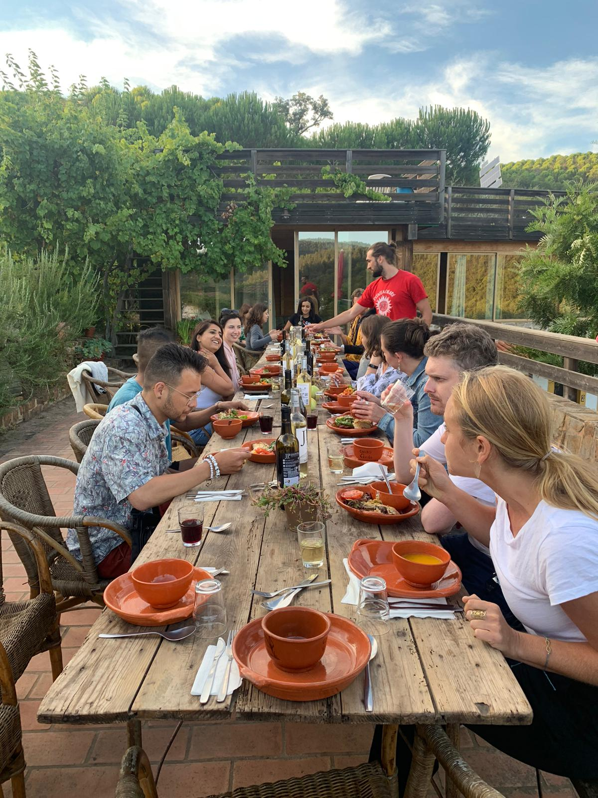
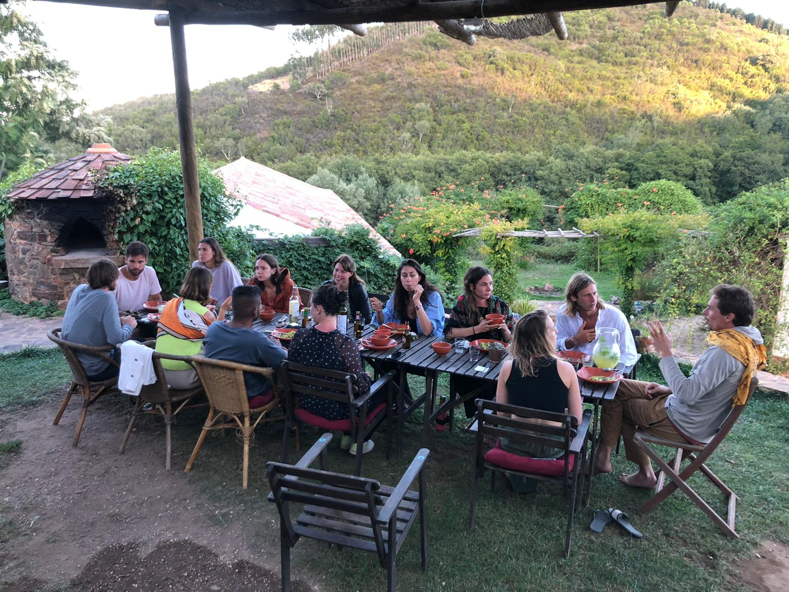
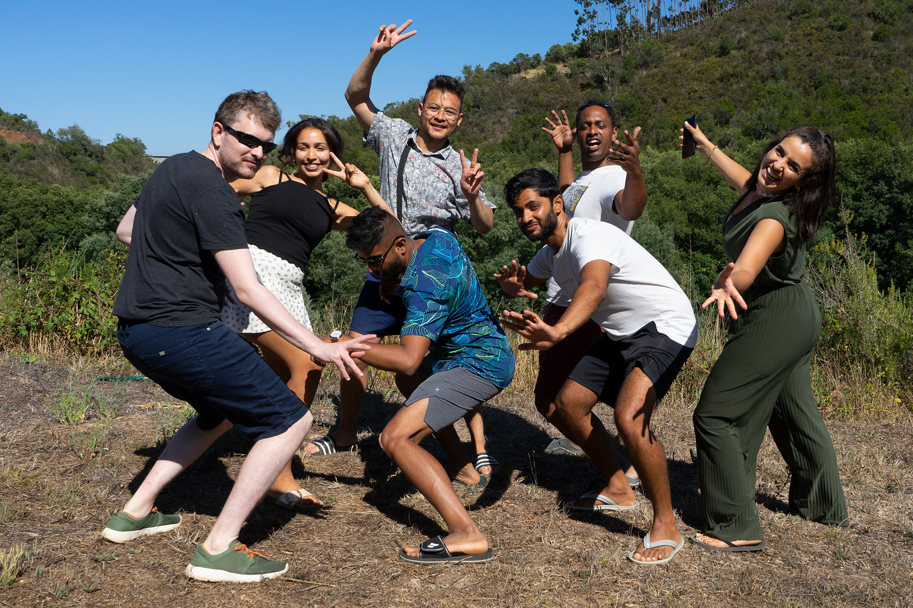
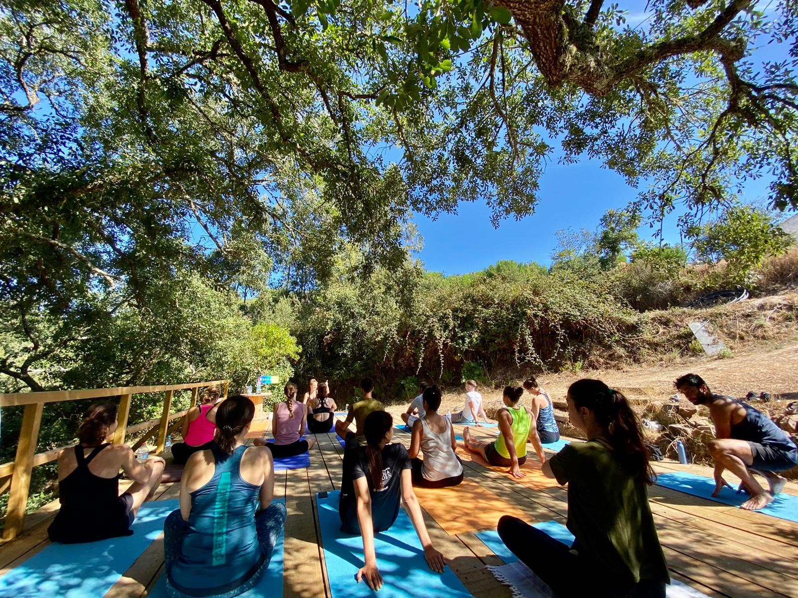

In August 2021, I got an opportunity to visit Portugal on a experiencial trip in the southern part Algarve of the country. I felt lucky to get a change to make the experience with other 60 founders, explorers and misfits from across the world.

Uprise was an community of explorers who want to change things in the world. Indeed it was a private collective for the new wave of founders, explorers & misfits.  With members taking entrepreneurial action together – for lives full of meaning, growth & impact.

[Uprise Member Summit 2021](https://www.uprise.academy/member-summit)

August 2021.  Algarve, Portugal.

I had an amazing time and learned alot during the trip. Below are some of the moments from the experience. If you would like to learn more about Uprise community and its history, please take a look at the website:

[Uprise Academy](https://www.uprise.academy/)


